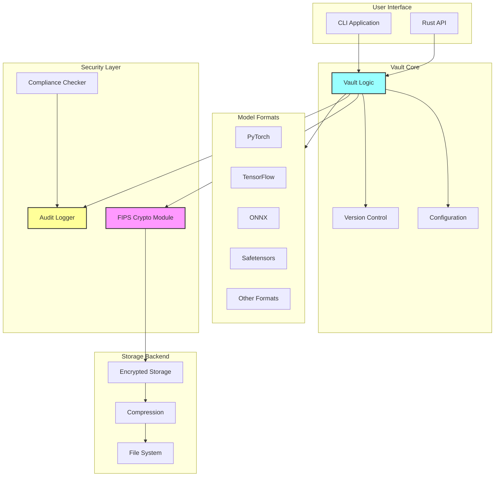
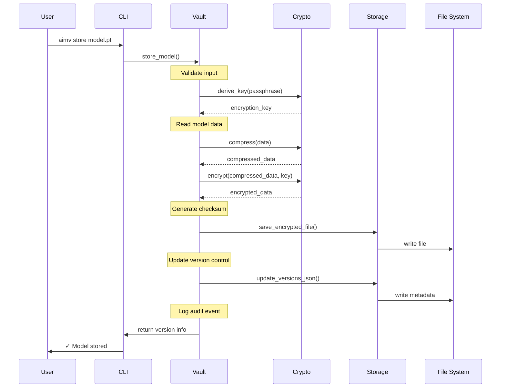
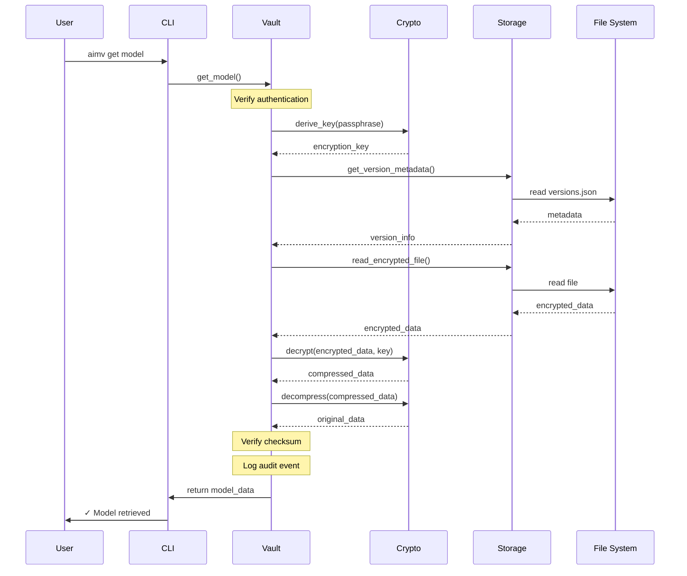
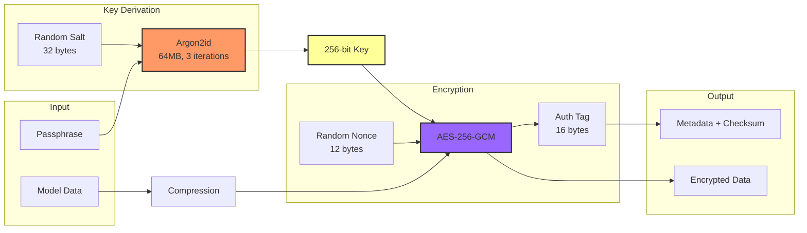
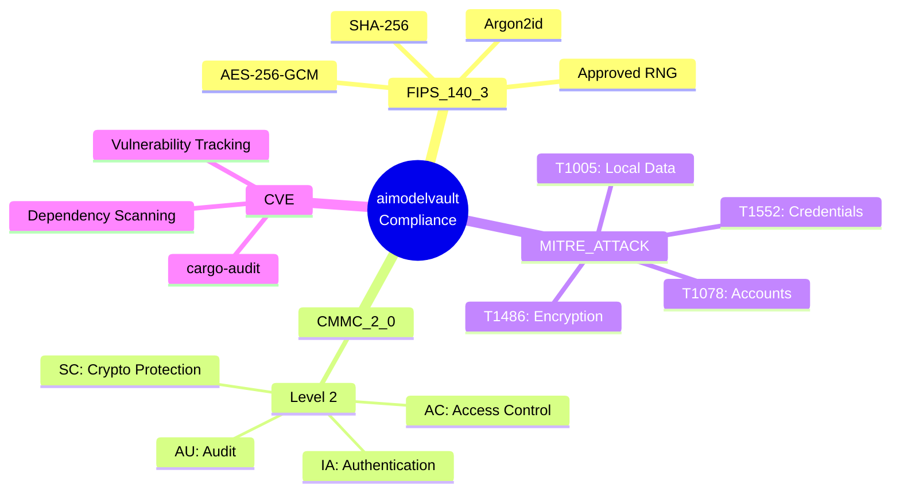
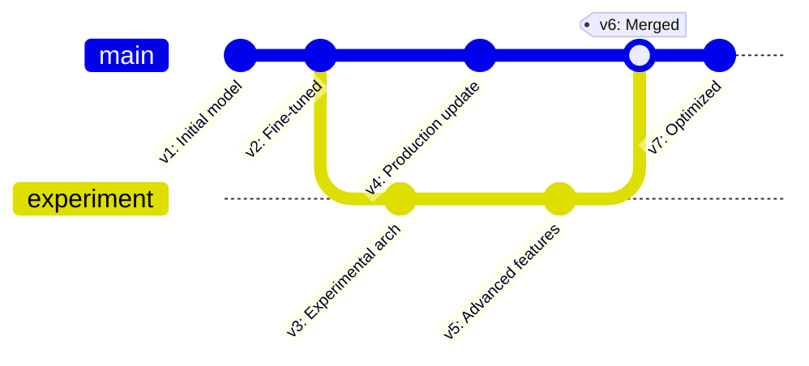
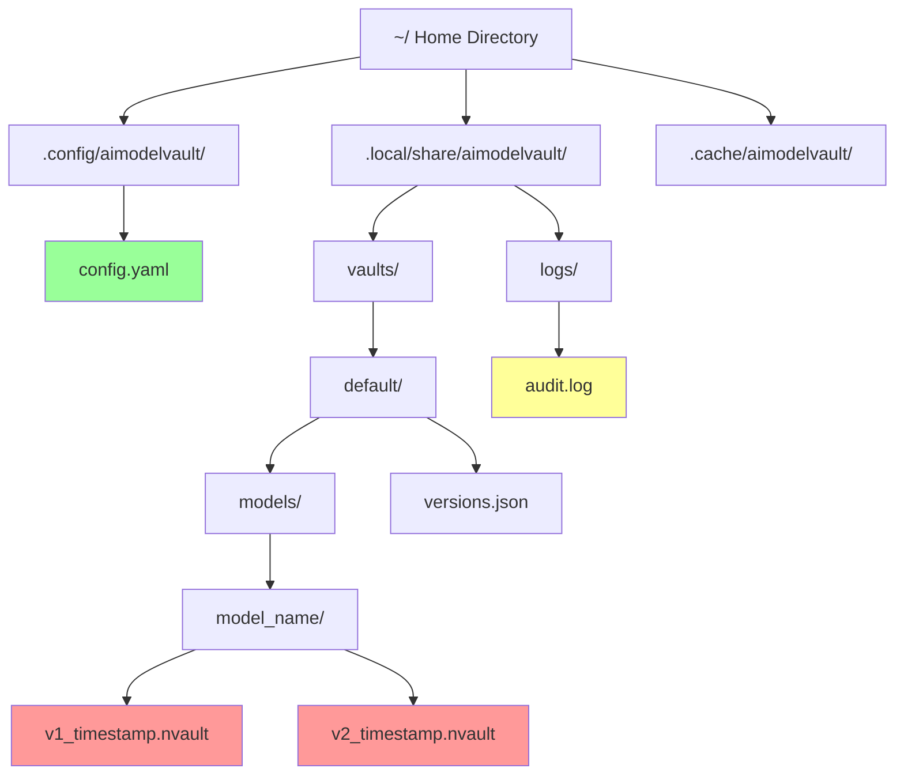
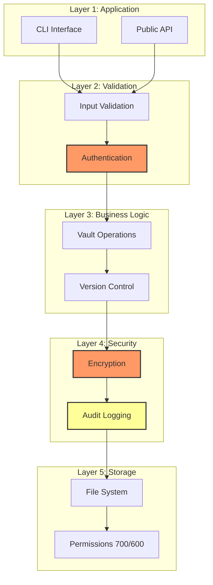
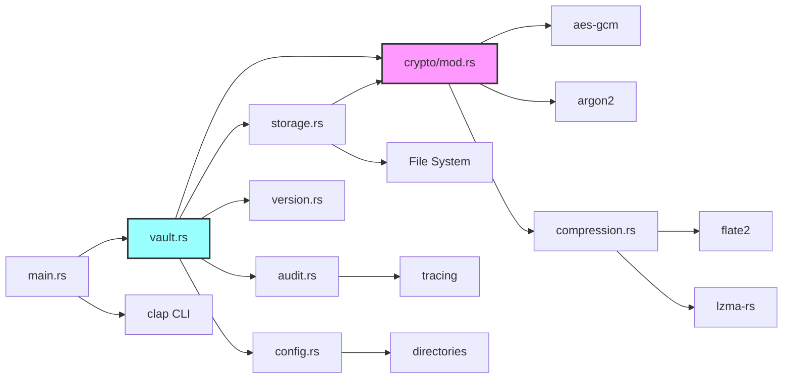

# aimodelvault Architecture

## System Architecture Diagram

## Data Flow - Store Model

## Data Flow - Retrieve Model

## Cryptographic Architecture

## Compliance Framework

## Version Control Structure

## Directory Structure (XDG Compliant)

## Security Layers

## Module Dependencies

